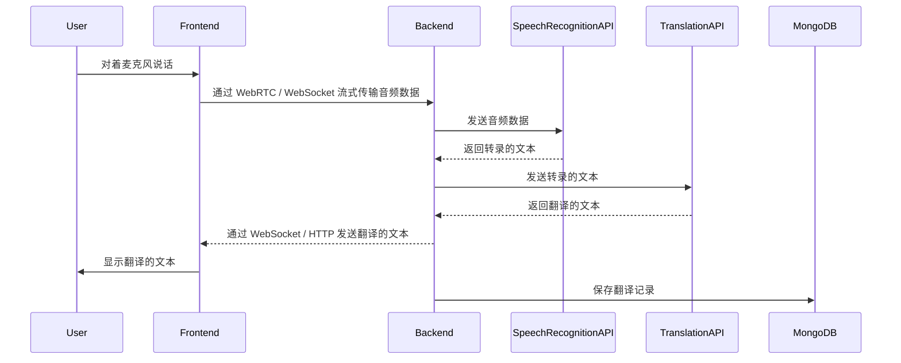

# 架构文档: AI 实时翻译

## 1. 概述

“AI 实时翻译”应用程序是一个基于 Web 的系统，旨在提供中英文之间的实时语音翻译。该架构基于现代客户端-服务器模型，前端采用 Next.js 单页应用程序 (SPA)，后端采用 Node.js，并使用多个外部服务进行翻译和语音转文本。

## 2. 组件

### 2.1. 前端 (客户端)
*   **框架**: Next.js (React)
*   **UI 组件库**: MUI (Material UI)，用于主题定制和 UI 组件
*   **职责**:
    *   渲染用户界面。
    *   使用 WebRTC / WebSocket 从用户的麦克风捕获音频。
    *   将音频数据发送到后端进行处理。
    *   向用户显示实时翻译结果。
    *   处理用户身份验证（Google/Hotmail 的 OAuth）。
    *   管理与主题和翻译历史相关的用户交互。
    *   authGuard。当用户登录成功，跳转到/dashboard页面。当用户未登录，跳转到/login页面。
    *   当login接到token和refresh token，记录，且实现当token快expire的时候，使用refresh token更新token。
    
### 2.2. 后端 (服务器)
*   **框架**: Node.js (使用 Fastify 等框架)
*   **职责**:
    *   为前端提供 RESTful API。
    *   处理用户身份验证和会话管理。
    *   与数据库（MongoDB 和 Redis）交互。
    *   协调翻译过程：
        1.  从客户端接收音频数据。
        2.  调用语音识别 API 将音频转换为文本。
        3.  调用翻译 API（Gemini 或 Kimi）翻译文本。
        4.  将翻译后的文本发送回客户端。
    *   从 MongoDB 存储和检索主题和翻译历史数据。
    *   从 Redis 缓存最近的翻译记录。
    *   JWT session storage.
    *   提供gmail和hotmail的oauth登陆的callback router。
    *   oauth成功后，添加新用户如果需要。同时返回token和refresh token。
    *   callback方法重定向为前台的/login?token=xxx&refreshToken=yyy。

### 2.3. 数据库
*   **主数据库**: MongoDB
    *   **用途**: 存储用户数据、主题和翻译历史。
*   **缓存数据库**: Redis
    *   **用途**: 缓存频繁访问的数据，例如用户会话信息或最近的翻译，以提高性能。

### 2.3.1. Auth Flow — OAuth + JWT

用户**只能**通过 OAuth 登录（Google Gmail 或 Microsoft Hotmail），不支持本地注册/密码。

**登录流程：**

```
前端
  └─► POST /auth/oauth  { provider: "google"|"hotmail", oauthToken }
        │
        ▼
        后端：向 OAuth 提供商验证 token，获取 email
        │
        ├─ MongoDB 中存在该 email？
        │     └─ YES → 直接签发 JWT
        │
        └─ NO → 创建新 User 文档 → 签发 JWT
```

- JWT 由本地 server 签发，存储于 Redis（含 TTL）作为 session。
- `userService` 的创建用户逻辑**仅在此处触发**，没有独立的"注册"接口。
- 登出时删除 Redis 中对应的 session key。

**登出流程：**
- 前端：用户点击导航栏设置 icon → 弹出 button group → 点击 Logout
- 前端：清除本地 token cookie → 调用后端登出接口 → 跳转到 /login
- 后端：提供 `POST /auth/logout` 路由，删除 Redis 中对应的 session key

**User Profile 流程：**
- 前端：用户点击导航栏设置 icon → 弹出 button group → 点击 User Profile
- 前端：中间 Panel 区域替换为 User Profile 页面（不跳转路由）
- User Profile 页面显示当前用户名，支持修改并保存
- 后端：提供用户名更新接口，更新 MongoDB 中的 User 文档 `name` 字段

### 2.4. 外部服务
*   **语音识别 API**: 将音频流转换为文本的外部服务。
*   **翻译 API**: 用于将文本从源语言翻译成目标语言的 Gemini API 或 Kimi API。
*   **OAuth 提供商**: 用于用户身份验证的 Google 和 Hotmail。

## 3. 数据流

下图说明了实时翻译请求的数据流：



## 4. 部署

该应用程序将使用现代 CI/CD 实践进行部署。
*   **前端**: Next.js 应用程序将部署到像 Vercel 这样的静态托管服务或类似平台。
*   **后端**: Node.js 后端将使用 Docker 进行容器化，并部署到像 AWS、Google Cloud 或 Azure 这样的云提供商。
*   **数据库**: 将使用云提供商的托管数据库服务来管理 MongoDB 和 Redis，以确保可伸缩性和可靠性。
