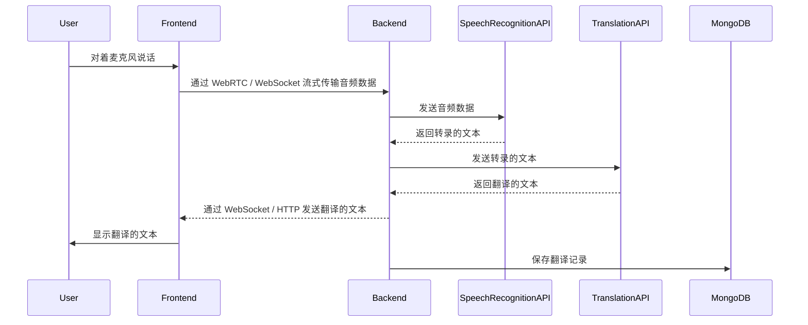

# 架构文档: AI 实时翻译

## 1. 概述

“AI 实时翻译”应用程序是一个基于 Web 的系统，旨在提供中英文之间的实时语音翻译。该架构基于现代客户端-服务器模型，前端采用 Next.js 单页应用程序 (SPA)，后端采用 Node.js，并使用多个外部服务进行翻译和语音转文本。

## 2. 组件

### 2.1. 前端 (客户端)
*   **框架**: Next.js (React)
*   **UI 组件库**: MUI (Material UI)，用于主题定制和 UI 组件
*   **职责**:
    *   渲染用户界面。
    *   使用 WebRTC / WebSocket 从用户的麦克风捕获音频。
    *   将音频数据发送到后端进行处理。
    *   向用户显示实时翻译结果。
    *   处理用户身份验证（Google/Hotmail 的 OAuth）。
    *   管理与主题和翻译历史相关的用户交互。

### 2.2. 后端 (服务器)
*   **框架**: Node.js (使用 Express.js 或 Fastify 等框架)
*   **职责**:
    *   为前端提供 RESTful API。
    *   处理用户身份验证和会话管理。
    *   与数据库（MongoDB 和 Redis）交互。
    *   协调翻译过程：
        1.  从客户端接收音频数据。
        2.  调用语音识别 API 将音频转换为文本。
        3.  调用翻译 API（Gemini 或 Kimi）翻译文本。
        4.  将翻译后的文本发送回客户端。
    *   从 MongoDB 存储和检索主题和翻译历史数据。

### 2.3. 数据库
*   **主数据库**: MongoDB
    *   **用途**: 存储用户数据、主题和翻译历史。
*   **缓存数据库**: Redis
    *   **用途**: 缓存频繁访问的数据，例如用户会话信息或最近的翻译，以提高性能。

### 2.4. 外部服务
*   **语音识别 API**: 将音频流转换为文本的外部服务。
*   **翻译 API**: 用于将文本从源语言翻译成目标语言的 Gemini API 或 Kimi API。
*   **OAuth 提供商**: 用于用户身份验证的 Google 和 Hotmail。

## 3. 数据流

下图说明了实时翻译请求的数据流：

## 4. 部署

该应用程序将使用现代 CI/CD 实践进行部署。
*   **前端**: Next.js 应用程序将部署到像 Vercel 这样的静态托管服务或类似平台。
*   **后端**: Node.js 后端将使用 Docker 进行容器化，并部署到像 AWS、Google Cloud 或 Azure 这样的云提供商。
*   **数据库**: 将使用云提供商的托管数据库服务来管理 MongoDB 和 Redis，以确保可伸缩性和可靠性。
